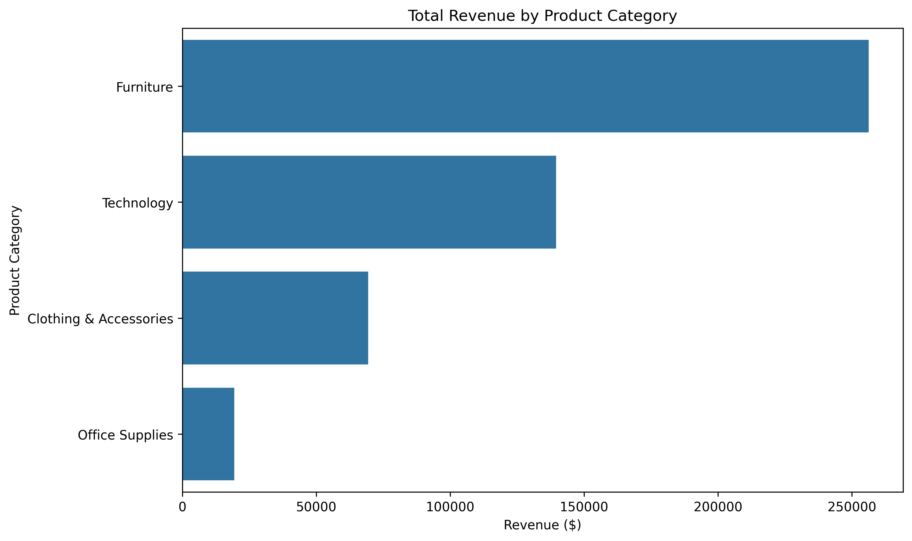
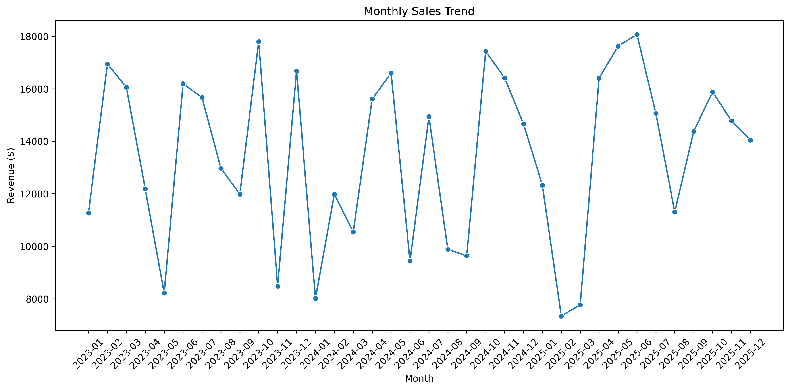
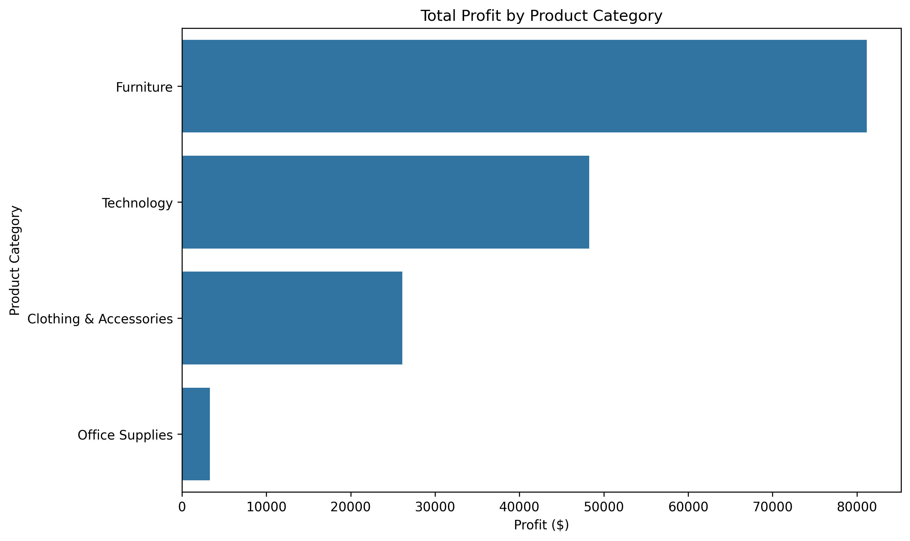
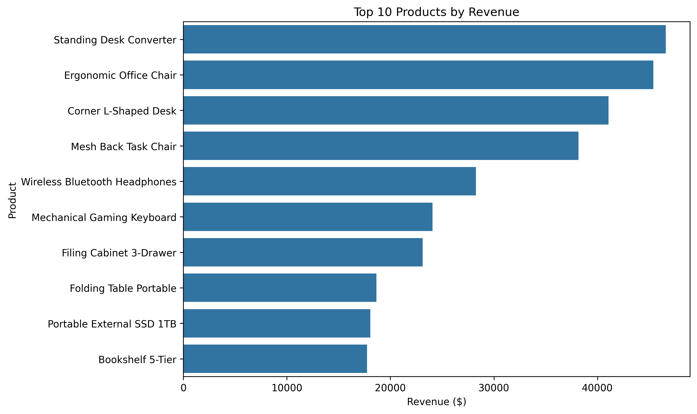

# Global E-Commerce Sales Analysis

## Project Overview

This project analyzes global e-commerce sales data to uncover revenue trends, product performance, profitability, and sales patterns.

The goal is to use Python and exploratory data analysis to answer practical business questions and generate actionable insights.

## Dataset

The dataset contains 2,000 e-commerce orders with information including:

- Order date
- Customer segment
- Country
- Region
- Product category
- Product name
- Quantity
- Unit price
- Discount percentage
- Total sales
- Shipping cost
- Profit
- Payment method

## Tools Used

- Python
- Pandas
- NumPy
- Matplotlib
- Seaborn
- Jupyter Notebook

## Key Metrics

- Total Revenue: **$484,559.34**
- Total Profit: **$158,872.32**
- Total Orders: **2,000**
- Total Customers: **1,534**
- Average Order Value: **$242.28**
- Profit Margin: **32.79%**

## Key Findings

- Furniture generated the highest revenue and profit among all product categories.
- Technology was the second strongest category in both revenue and profit.
- The highest sales month was **June 2025**, with approximately **$18,068** in revenue.
- The lowest sales month was **February 2025**, with approximately **$7,337** in revenue.
- The **Standing Desk Converter** was the highest-revenue product.
- Office Supplies generated significantly less revenue and profit than the other categories.

## Visualizations

### Revenue by Product Category



### Monthly Sales Trend



### Profit by Product Category



### Top 10 Products by Revenue



## Business Recommendations

- Prioritize high-performing Furniture products in inventory and promotional campaigns.
- Investigate why Office Supplies are underperforming.
- Use top-performing products for bundles and cross-selling opportunities.
- Investigate the causes of weak-performing sales months.
- Track profit alongside revenue when evaluating product performance.

## Project Structure

```text
retail-sales-analysis/
│
├── data/
│   └── global_ecommerce_sales.csv
│
├── notebooks/
│   └── retail_sales_analysis.ipynb
│
├── images/
│   ├── revenue_by_category.png
│   ├── monthly_sales_trend.png
│   ├── profit_by_category.png
│   └── top_10_products.png
│
├── README.md
├── requirements.txt
└── .gitignore
```

## How to Run

1. Clone this repository.

2. Create a Python virtual environment:

```bash
python -m venv .venv
```

3. Activate the virtual environment.

Windows PowerShell:

```powershell
.\.venv\Scripts\Activate.ps1
```

macOS/Linux:

```bash
source .venv/bin/activate
```

4. Install the required packages:

```bash
pip install -r requirements.txt
```

5. Open the notebook:

```text
notebooks/retail_sales_analysis.ipynb
```

6. Run the notebook cells from top to bottom.

## Skills Demonstrated

- Data cleaning
- Exploratory data analysis
- KPI calculation
- Data visualization
- Time-series analysis
- Business insight generation